# Introducing Flask Quickstart Generator.

  

Are you tired of spending valuable time setting up the same boilerplate code every time you start a new Flask project? Say hello to Flask Quickstart Generator - your ultimate time-saving tool for Flask development!

Flask Quickstart Generator streamlines the development process by automating the setup of a Flask project with just a few simple commands. Whether you're a seasoned Flask developer or just starting out, this tool will help you get your project up and running in no time.

## Install and update the package
| Install and update  |   
| ------------- | 
|pip install -U flask-quickstart-generator 

## Version 1.1.3 – Features (April 5, 2025)
| Features  |   Status | Details
| ------------- | ------------- | -------- |
|**Built-in Admin Dashboard:** |✅          | Comes with a fully integrated admin panel for managing key parts of the application.
|**User Authentication System:**|✅         | Users must log in before accessing the dashboard, with role-based access control.
|**Profile & Account Management:**|✅            | Authenticated users can view and update their profile details, including account settings.
|**User Registration with Role Assignment:**|✅          | Supports user sign-up and assigning specific roles (e.g., admin, user).
|**Comprehensive Error Handling Pages:**|✅          | Custom templates for HTTP errors like 400, 401, 403, 404, 413, 429, 500, and 503. Includes handling for exceptions like ValueError.
|**Maintenance Mode (503):**|✅          | Shows a maintenance page when the app is under scheduled updates.
|**Flash Messaging for Rate Limits:**|✅          | Uses Flask’s flash() to alert users (e.g., for 429 errors: too many requests).
|**Session Timeout Auto Logout:**|✅          | Logs users out automatically after inactivity for better security.
|**Responsive Design:**|✅          | Fully responsive layout that works across mobile, tablet, and desktop.
|**Theme Customization:**|✅          | Offers pre-built themes or theme switching for a modern UI.
|**Automatic DB Migration Init:**|✅          | Automatically checks for and initializes the Flask-Migrate folder via flask db init, saving setup time.
|**Debug Logging Setup:**|✅          | Uses logging.basicConfig(level=logging.DEBUG) to provide detailed logs for pinpointing errors and tracking behavior.
|**Color-Coded Terminal Logs:**|✅          | Adds colorful terminal outputs in middleware and response hooks to make request flow and security header injection easier to track.

## Features
| Features  |   Status | Details
| ------------- | ------------- | -------- |
|**Effortless Setup:** |✅          | Simply install the package from PyPI OR github and use the command-line interface to create a new Flask project with a predefined folder structure and blueprint setup.
|**Virtual Environment Management:**|✅         | Automatically sets up a virtual environment for your project, ensuring clean and isolated dependencies.
|**Blueprint Configuration:**|✅            | Quickly scaffold your project with pre-configured blueprints for common application `components` like `authentication`, `administration`, `error handling`, `search`, `caching`, `db migrations`, `uploads`, `account settings`, `views`, `database`(model) and more.
|**Security Enhancements:**|✅          | Includes built-in security measures such as CSRF protection, HTTP headers middleware, and secure session management to help keep your application safe from common vulnerabilities.
|**logging:**|✅          | Easier Debugging Debug messages can include detailed information about variables, function calls, and the state of your application. This makes it easier to pinpoint where things might be going wrong.
|**Flask-Compress:**|✅          | Flask-Compress is an extension for Flask that compresses the response data sent from your Flask application to the client. By compressing the data, it helps reduce the size of the response, leading to faster data transfer and reduced bandwidth usage
|**login_manager, LoginManager:**|✅          | It handles user session management. This includes logging users in and out, managing session tokens, and providing user information to views.

## Robust Request Handling and Enhanced Security Measures 
| Features  |   Status | Details
| ------------- | ------------- | -------- |
|**URL Validation:**|✅         | Ensures valid request path format by rejecting paths without a leading slash or containing non-alphanumeric characters (excluding root URL).This helps prevent potential security issues and improves routing clarity.
|**URL Canonicalization:**|✅           | Redirects URLs with uppercase letters to their lowercase equivalents. This promotes consistency and prevents duplicate content issues.         
|**Trailing Slash Removal:**|✅         | Removes trailing slashes from URLs (except for the root URL) to prevent duplicate content issues, search engine optimization (SEO) problems and duplicate content.
|**Enhanced Security Measures:**|✅         

**In addition to features mentioned previously**

| Features  |   Status | Details
| ------------- | ------------- | -------- |
|**Flask Minify:**|✅         | Flask Quickstart Generator integrates with Flask-Minify to automatically minify HTML, JavaScript and CSS files, improving page load times and performance.
|**Rate Limiting**|✅           |Flask-Limiter, a powerful tool for implementing rate limiting in your application. This helps protect your server from malicious attacks by limiting the number of requests a client can send within a specific timeframe.
|The default configuration in `__init__.py` sets a limit of 3000 requests per hour. You can easily customize this limit to fit your specific needs.

# Benefits of Rate Limiting:
| Benefits  |   Status | Details
| ------------- | ------------- | -------- |
|1. Mitigates denial-of-service (DoS) attacks by preventing a single user or automated script from overwhelming your server with requests.|✅ |✅ 
|2. Improves application performance by ensuring resources are available to legitimate users.|✅ |✅ 
|3. Enhances security by making it more difficult for attackers to exploit vulnerabilities.|✅ |✅ 

## Comprehensive Security Headers 
| Security Headers  |   Status | Details
| ------------- | ------ | -------- |
|**Clickjacking Protection:** |✅       |Sets the `X-Frame-Options` header to `DENY`, effectively blocking clickjacking attacks that attempt to trick users into clicking on malicious content within your application's frame.
|**Referrer-Policy Control:** |✅       |Limits referrer information exposure using the `Referrer-Policy` header. This can be set to `strict-origin-when-cross-origin` to restrict referrer leaks to the same origin (your domain) when navigating away from your site in a cross-origin context. Alternatively, for stricter control, you can use `no-referrer` to prevent any referrer information from being sent.
|**MIME-Sniffing Prevention:** |✅      |Configures `X-Content-Type-Options` to `nosniff`. This mitigates MIME-sniffing vulnerabilities where the browser attempts to guess the content type of a resource based on its initial bytes, potentially allowing attackers to inject malicious content.
|**Content Security Policy (CSP):** |✅     |Implements a foundational CSP to restrict resource loading and enhance protection against XSS and data injection attacks. You can further customize this policy to specify allowed origins for scripts, stylesheets, fonts, images, and other resources. The provided example serves as a starting point:
|**Strict-Transport-Security (STS):** |✅     |The Strict-Transport-Security header is used to enforce secure connections between the browser and the server by instructing the browser to only communicate with the server over HTTPS. Here's what each part of the header does:
Purpose:
Prevent downgrade attacks: It prevents attackers from tricking users into using HTTP instead of HTTPS.
Protect against cookie hijacking: Cookies sent over HTTPS are encrypted, making it harder for attackers to steal session cookies.

**Increased Developer Efficiency:**

With Flask Quickstart Generator, you can focus on building the core functionalities of your application instead of wasting time on repetitive setup tasks. This translates to faster development cycles, improved productivity, and a more enjoyable development experience.

Flask Quickstart Generator empowers you with a comprehensive set of features to streamline request processing and safeguard your application against common web vulnerabilities.

## User Commands: To Get Started Quickly 

Flask Quickstart Generator provides convenient commands to streamline your project setup:

**Create Project Folder:**

`Bash or Terminal`

**flask-manage create-app my_demo_app** 

(This command creates Flask project with a predefined folder structure and blueprint setup) 

**===Create Virtual Environment:===**

`Bash or Terminal`

**flask-manage -v**

(The -v flag creates a virtual environment to isolate your project's dependencies.)

**Create Both (Virtual Environment & Flask project with a predefined folder structure and blueprint setup)**

`Bash or Terminal`

**flask-manage -v create-app my_demo_app**

# Requirements to Intall :
| Requirements  |   
| ------------- | 
|alembic==1.13.1 
Babel==2.15.0  
bcrypt==4.1.3   
blinker==1.8.2  
cachelib==0.9.0 
click==8.1.7    
colorama==0.4.6 
cssmin==0.2.0   
Deprecated==1.2.14  
Flask==3.1.0    
Flask-Assets==2.1.0 
flask-babel==4.0.0  
Flask-Bcrypt==1.0.1 
Flask-Caching==2.3.0    
Flask-Limiter==3.6.0    
Flask-Login==0.6.3  
Flask-Migrate==4.0.7    
Flask-Session==0.8.0    
Flask-SQLAlchemy==3.1.1 
Flask-WTF==1.2.1    
greenlet==3.0.3 
importlib_resources==6.4.0  
itsdangerous==2.2.0 
Jinja2==3.1.4     
limits==3.11.0  
Mako==1.3.3 
markdown-it-py==3.0.0   
MarkupSafe==2.1.5   
mdurl==0.1.2    
msgspec==0.18.6 
ordered-set==4.1.0  
packaging==24.0 
pillow==10.3.0  
Pygments==2.18.0    
pytz==2024.1    
rich==13.7.1     
SQLAlchemy==2.0.30  
typing_extensions==4.11.0   
webassets==2.0  
Werkzeug==3.0.3 
wrapt==1.16.0   
WTForms==3.1.2  

## Note 
1. You can change `my_demo_app` to any name of your choice

## Link to the github 

**https://github.com/Kennarttechl/flask_quickstart_generator.git**

## Screenshot

| Screenshot | Name |
----------|-----
| Successful Installation |  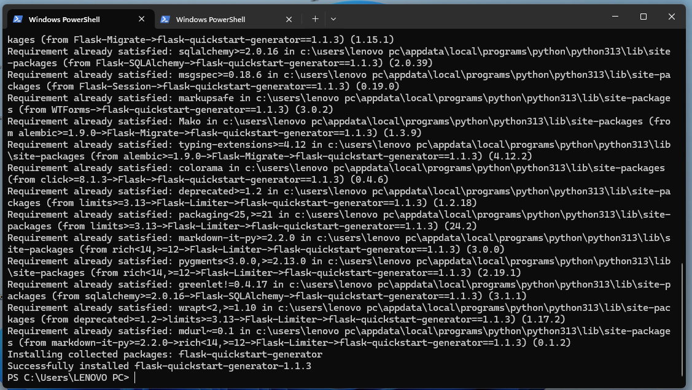 |
| Creating Project |  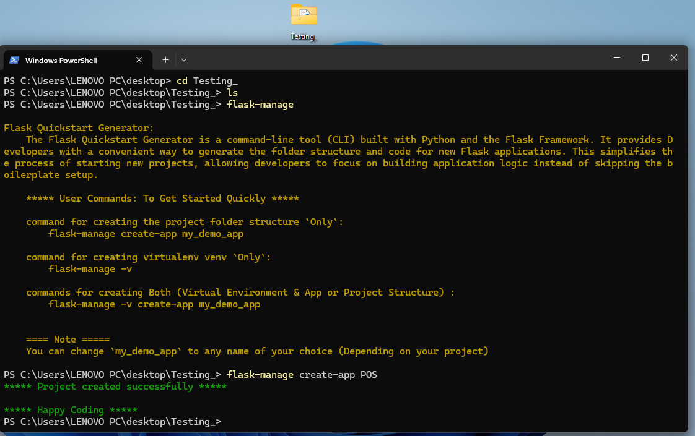 |
| Folder Structure |  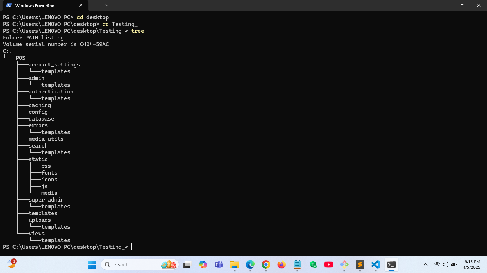 |
| Running wsgi/initializing |  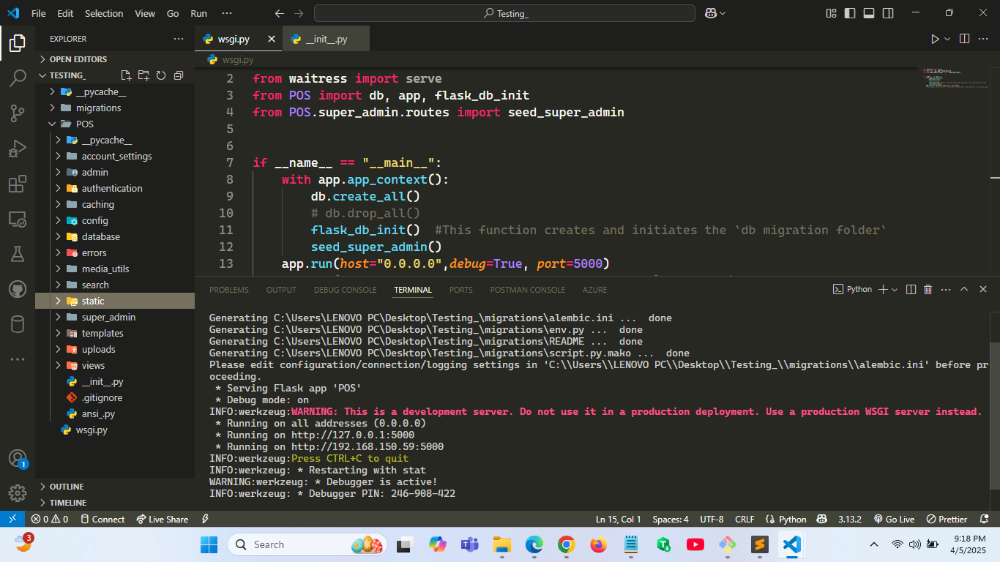 |
| Project Running Successful |  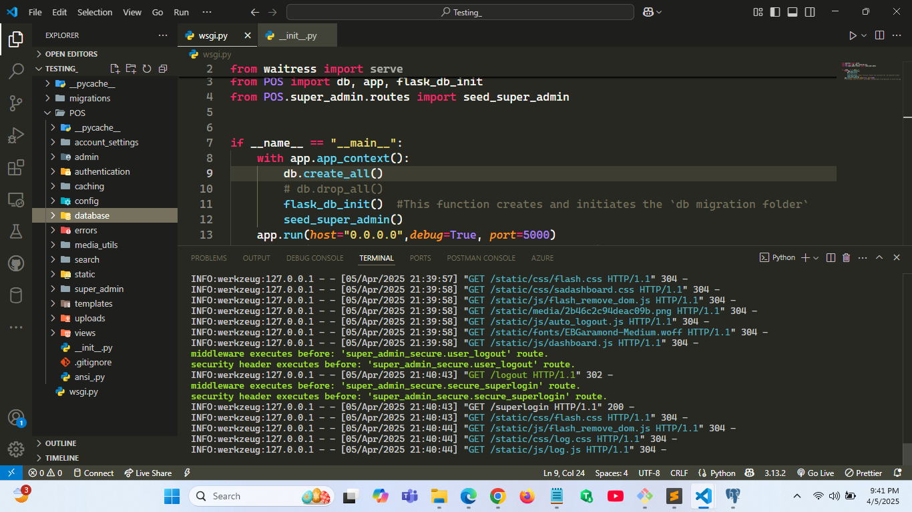 |
| View Page |  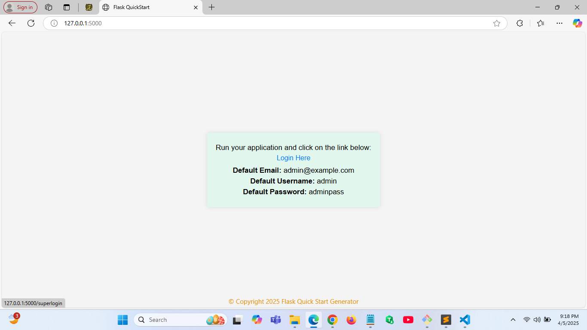 |
| Admin Login Page |  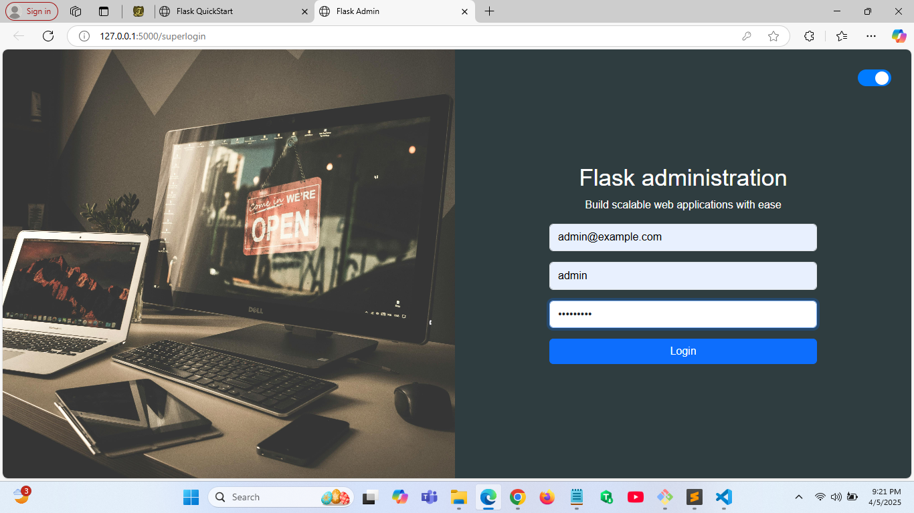 |
| Login page(Mobile View) |  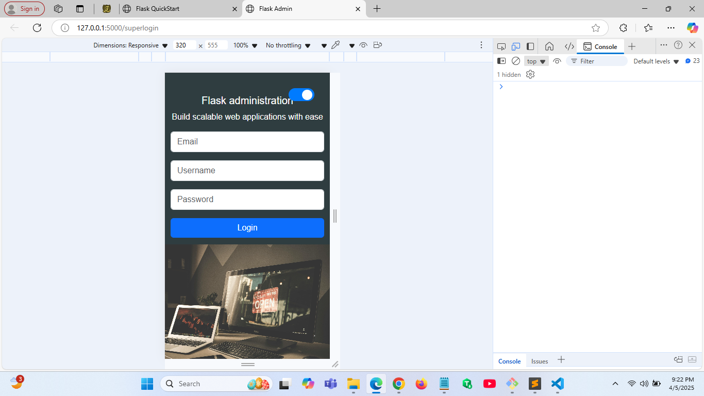 |
| Login page(Theme change) |  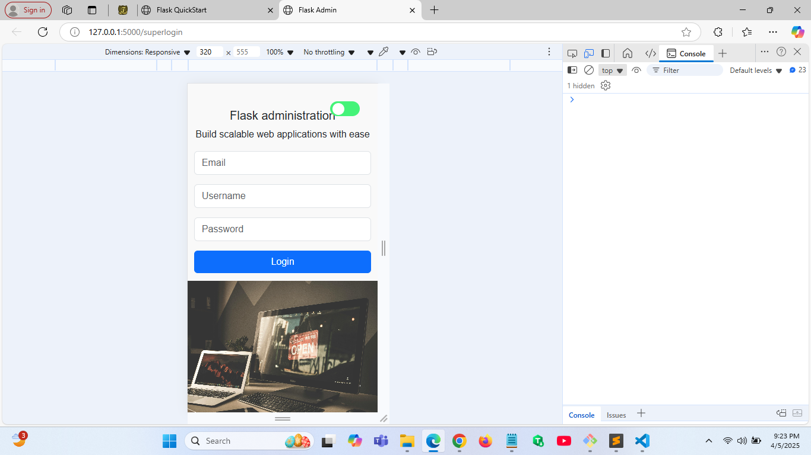 |
| Admin Dashboard |  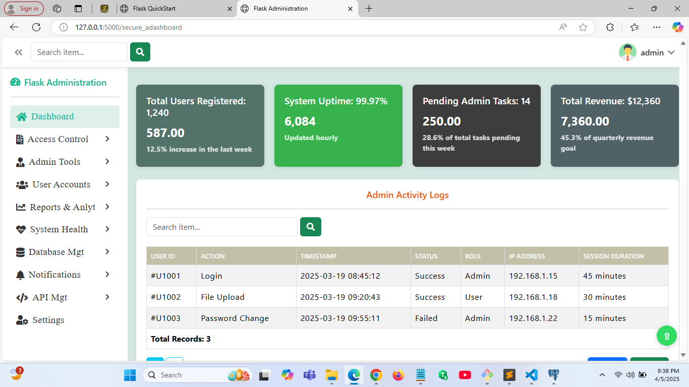 |
| Dashboard Mobile View |  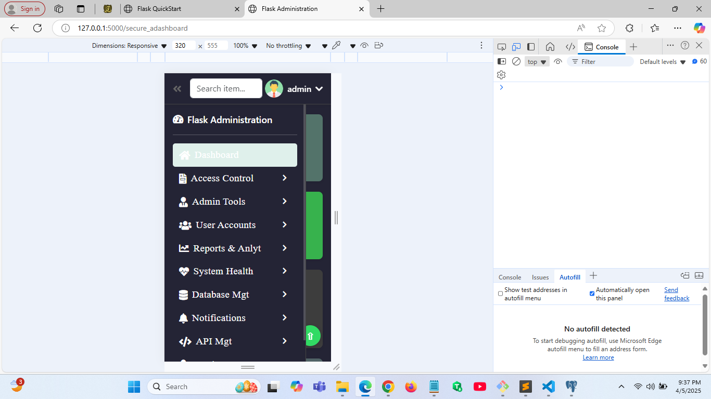 |
| Installation |   |
| Commands  |   |
| Project Creating |  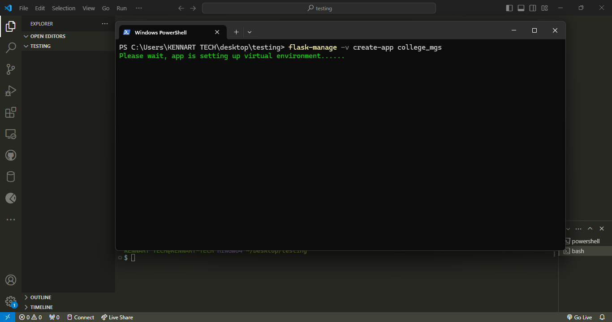 |
| Installation Complete  |   |
| Application Startup  |  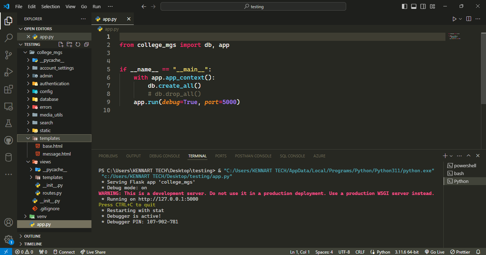 |
|Landing Page   |   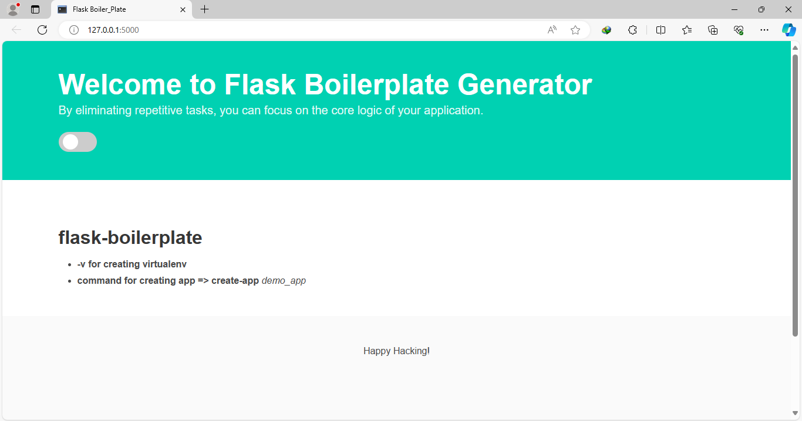|

